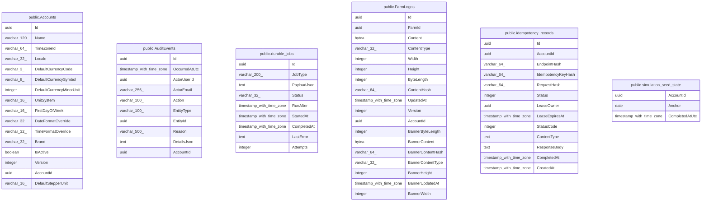

# Platform & operations

## Description

Tenancy root, audit, jobs, idempotency, seeding bookkeeping.

## Tables

| Name | Columns | Comment | Type |
| ---- | ------- | ------- | ---- |
| [public.Accounts](public.Accounts.md) | 16 |  | BASE TABLE |
| [public.AuditEvents](public.AuditEvents.md) | 10 |  | BASE TABLE |
| [public.durable_jobs](public.durable_jobs.md) | 9 |  | BASE TABLE |
| [public.FarmLogos](public.FarmLogos.md) | 18 |  | BASE TABLE |
| [public.idempotency_records](public.idempotency_records.md) | 13 |  | BASE TABLE |
| [public.simulation_seed_state](public.simulation_seed_state.md) | 3 |  | BASE TABLE |

## Relations

---

> Generated by [tbls](https://github.com/k1LoW/tbls)
